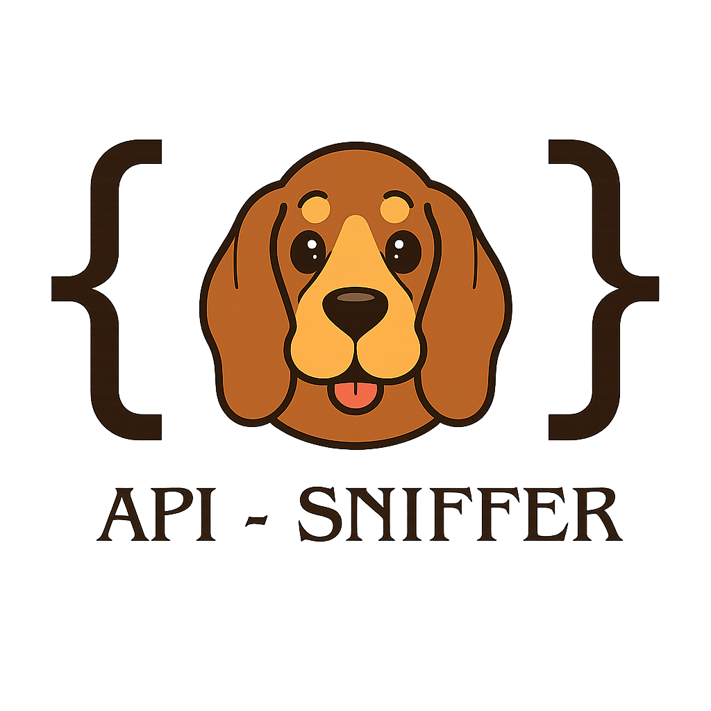

<div align="center">
  
  <h1>🔍 API Sniffer</h1>
</div>

[](https://badge.fury.io/js/api-sniffer)
[](https://opensource.org/licenses/MIT)

Middleware for Express, Koa, and Fastify to log API requests and responses with a beautiful CLI dashboard. Perfect for debugging, monitoring, and development.

## ✨ Features

- 🚀 **Multi-Framework Support**: Works with Express, Koa, and Fastify
- 📊 **Dashboard**: Terminal and web dashboard with stats and logs
- 🛡️ **Security First**: Automatic masking of sensitive fields (passwords, tokens, etc.)
- 📁 **Export Capabilities**: Export logs to JSON or CSV formats
- 🎯 **Flexible Filtering**: Filter logs by method, status code, path patterns
- ⚡ **Zero Configuration**: Works out of the box with sensible defaults
- 🔧 **Highly Configurable**: Customize logging levels, storage, and masking rules

## 📦 Installation

```bash
npm install api-sniffer
```

## 🚀 Quick Start

### Express (Default)

```javascript
const express = require('express');
const { apiSniffer } = require('api-sniffer');

const app = express();

// Add API Sniffer middleware (defaults to Express)
app.use(apiSniffer());

app.get('/api/users', (req, res) => {
  res.json({ users: ['Alice', 'Bob'] });
});

app.listen(3000);
```

### Auto-Start UI Dashboard

```javascript
const express = require('express');
const { apiSniffer } = require('api-sniffer');

const app = express();

// Add API Sniffer middleware with auto-start UI
app.use(apiSniffer({
  logLevel: 'full',
  autoStartUI: true,    // Automatically start UI server
  uiPort: 3333,         // UI server port
  uiOpen: true,         // Open UI in browser automatically
  showAsciiLogo: true   // Show ASCII logo on startup (default: true)
}));

app.get('/api/users', (req, res) => {
  res.json({ users: ['Alice', 'Bob'] });
});

app.listen(3000);
// UI Dashboard will start automatically on port 3333
// Browser will open automatically to the dashboard
```

### Disable ASCII Logo

```javascript
// Disable ASCII logo display
app.use(apiSniffer({
  logLevel: 'full',
  autoStartUI: true,
  uiPort: 3333,
  uiOpen: true,
  showAsciiLogo: false  // Disable ASCII logo
}));
```

### TypeScript Support

```typescript
import { apiSniffer, ApiSnifferOptions } from 'api-sniffer';

const options: ApiSnifferOptions = {
  logLevel: 'full',
  maxLogs: 1000,
  maskFields: ['secret', 'token']
};

app.use(apiSniffer(options));
```

### ES Modules

```javascript
import { apiSniffer } from 'api-sniffer';

app.use(apiSniffer({
  logLevel: 'minimal',
  fileStore: true
}));
```

### Koa

```javascript
const Koa = require('koa');
const { apiSniffer } = require('api-sniffer');

const app = new Koa();

// Add API Sniffer middleware
app.use(apiSniffer.koa());

app.use((ctx) => {
  ctx.body = { users: ['Alice', 'Bob'] };
});

app.listen(3000);
```

### Fastify

```javascript
const fastify = require('fastify')({ logger: true });
const { apiSniffer } = require('api-sniffer');

// Register API Sniffer plugin
fastify.register(apiSniffer.fastify());

fastify.get('/api/users', async (request, reply) => {
  return { users: ['Alice', 'Bob'] };
});

fastify.listen({ port: 3000 });
```

### Framework Auto-Detection

```javascript
const { apiSniffer } = require('api-sniffer');

// Auto-detect framework
const middleware = apiSniffer.auto();

// Use with Express
app.use(middleware.express());

// Use with Koa
app.use(middleware.koa());

// Use with Fastify
fastify.register(middleware.fastify());
```

## 📁 Export & Analysis

Export your logs for further analysis using the programmatic API:

```javascript
// Export logs programmatically
const { apiSniffer } = require('api-sniffer');

// Get logs and export to JSON
const logs = apiSniffer.utils.getLogs();
const jsonData = JSON.stringify(logs, null, 2);

// Export to CSV format
const csvData = apiSniffer.utils.exportLogs('csv');
```

## ⚙️ Configuration

### Basic Configuration

```javascript
const { apiSniffer } = require('api-sniffer');

app.use(apiSniffer({
  logLevel: 'full',           // 'minimal', 'headers-only', 'full'
  maxLogs: 1000,             // Maximum logs to store in memory
  maskFields: ['secret']     // Additional fields to mask
}));
```

### Advanced Library Usage

#### Selective Imports

```javascript
// Import only what you need
const { createExpressMiddleware, FileStore } = require('api-sniffer');

// Create custom store
const customStore = new FileStore({
  filePath: './custom-logs.json',
  maxSize: 5000
});

// Use with custom store
app.use(createExpressMiddleware({
  store: customStore,
  logLevel: 'minimal'
}));
```

#### Programmatic Access

```javascript
const { apiSniffer, store } = require('api-sniffer');

// Listen for new logs
store.on('newLog', (logEntry) => {
  console.log('New request:', logEntry.request.path);
});

// Get statistics programmatically
const stats = apiSniffer.utils.getStats();
console.log(`Total requests: ${stats.totalRequests}`);

// Filter logs
const errorLogs = apiSniffer.utils.getLogs({
  statusCode: 500,
  limit: 10
});
```

#### Custom Store Configuration

```javascript
const { FileStore } = require('api-sniffer');

const customStore = new FileStore({
  filePath: './api-logs.json',
  maxSize: 10000,
  maskFields: ['password', 'token', 'secret'],
  writeInterval: 50,
  writeBatchSize: 20,
  writeDebounceMs: 25
});

app.use(apiSniffer({
  store: customStore,
  logLevel: 'full'
}));
```

### Advanced Configuration

```javascript
app.use(apiSniffer({
  // Write configuration
  writeInterval: 100,          // Base write interval (ms)
  writeBatchSize: 10,          // Batch writes for performance
  writeDebounceMs: 50,         // Debounce rapid writes
  
  // Refresh handling
  refreshOnStartup: true       // Refresh data on startup
}));
```

### Log Levels

- **`minimal`**: Only method, path, status code, and response time
- **`headers-only`**: Includes request/response headers but no body
- **`full`**: Complete request and response logging (default)

### Custom Store

```javascript
const { apiSniffer, LogStore } = require('api-sniffer');

// Create custom store with specific configuration
const customStore = new LogStore({
  maxSize: 5000,
  maskFields: ['customSecret', 'internalId']
});

app.use(apiSniffer({
  store: customStore,
  logLevel: 'full'
}));
```

## 🛡️ Security & Privacy

API Sniffer automatically masks sensitive fields to protect your data:

### Default Masked Fields
- `password`
- `authorization` 
- `token`
- `secret`
- `key`
- `apikey`
- `api-key`
- `cookie`
- `session`
- `x-api-key`
- `x-auth-token`

### Custom Masking

```javascript
app.use(apiSniffer({
  maskFields: [
    'customSecret',
    'internalToken',
    'sensitiveData'
  ]
}));
```

## 🌐 Web Dashboard

Start the web-based dashboard to monitor your API:

```javascript
const { apiSniffer } = require('api-sniffer');

// Start UI server programmatically
const serverInfo = await apiSniffer.startUI({
  port: 3333,
  host: 'localhost',
  open: true  // Automatically open in browser
});

console.log(`Dashboard: ${serverInfo.dashboardUrl}`);
```

### Dashboard Features

- 📊 **Statistics**: Total requests, average response time, error rate
- 📋 **Recent Requests**: List of incoming requests with filtering
- 🎯 **Top Endpoints**: Most frequently accessed endpoints
- 📈 **Status Code Distribution**: Visual breakdown of response codes
- 🔄 **Real-time Updates**: Manual refresh button for live data
- 🔍 **Advanced Filtering**: Filter by method, status, path patterns
- 📁 **Export Functionality**: Download logs in JSON/CSV format

## 📚 API Reference

### Main Functions

#### `apiSniffer(options?: ApiSnifferOptions): Function`
Creates Express middleware (default behavior).

```javascript
const middleware = apiSniffer({
  logLevel: 'full',
  maxLogs: 1000,
  maskFields: ['secret']
});
```

#### `apiSniffer.express(options?: ApiSnifferOptions): Function`
Creates Express/Connect middleware.

```javascript
const expressMiddleware = apiSniffer.express({
  logLevel: 'minimal'
});
```

#### `apiSniffer.koa(options?: ApiSnifferOptions): Function`
Creates Koa middleware.

```javascript
const koaMiddleware = apiSniffer.koa({
  logLevel: 'headers-only'
});
```

#### `apiSniffer.fastify(options?: ApiSnifferOptions): Function`
Creates Fastify plugin.

```javascript
const fastifyPlugin = apiSniffer.fastify({
  logLevel: 'full'
});
```

#### `apiSniffer.auto(options?: ApiSnifferOptions): Object`
Creates auto-detection middleware object.

```javascript
const autoMiddleware = apiSniffer.auto();
app.use(autoMiddleware.express());
```

### Configuration Options

| Option | Type | Default | Description |
|--------|------|---------|-------------|
| `logLevel` | string | `'full'` | Logging level: 'minimal', 'headers-only', 'full' |
| `maxLogs` | number | `1000` | Maximum logs to store in memory |
| `maskFields` | string[] | `[]` | Additional fields to mask beyond defaults |
| `store` | LogStore/FileStore | global | Custom store instance |
| `fileStore` | boolean | `true` | Use file-based storage |
| `filePath` | string | `'.api-sniffer-logs.json'` | Custom file path for logs |
| `writeInterval` | number | `100` | Base write interval (ms) |
| `writeBatchSize` | number | `10` | Batch writes for performance |
| `writeDebounceMs` | number | `50` | Debounce rapid writes |
| `refreshOnStartup` | boolean | `true` | Refresh data on startup |
| `autoStartUI` | boolean | `false` | Automatically start UI server |
| `uiPort` | number | `3333` | Port for UI server |
| `uiHost` | string | `'localhost'` | Host for UI server |
| `uiOpen` | boolean | `false` | Automatically open UI in browser |
| `showAsciiLogo` | boolean | `true` | Show ASCII logo on startup |

### Store Classes

#### `LogStore`
In-memory log storage.

```javascript
const { LogStore } = require('api-sniffer');
const store = new LogStore({
  maxSize: 1000,
  maskFields: ['password']
});
```

#### `FileStore`
File-based log storage with persistence.

```javascript
const { FileStore } = require('api-sniffer');
const store = new FileStore({
  filePath: './logs.json',
  maxSize: 5000,
  writeInterval: 50
});
```

### Utility Functions

#### `apiSniffer.utils.getLogs(options?: LogFilterOptions): LogEntry[]`
Get filtered logs programmatically.

```javascript
const logs = apiSniffer.utils.getLogs({
  method: 'POST',
  statusCode: 500,
  limit: 10
});
```

#### `apiSniffer.utils.getStats(): Statistics`
Get current statistics.

```javascript
const stats = apiSniffer.utils.getStats();
console.log(`Total requests: ${stats.totalRequests}`);
```

#### `apiSniffer.utils.exportLogs(format?: 'json' | 'csv'): string`
Export logs in specified format.

```javascript
const jsonData = apiSniffer.utils.exportLogs('json');
const csvData = apiSniffer.utils.exportLogs('csv');
```

#### `apiSniffer.utils.clearLogs(): void`
Clear all stored logs.

```javascript
apiSniffer.utils.clearLogs();
```

#### `apiSniffer.utils.getSyncStatus(): SyncStatus`
Get sync configuration and performance metrics.

```javascript
const syncStatus = apiSniffer.utils.getSyncStatus();
console.log('Sync mode:', syncStatus.state.currentMode);
```

### UI Server

#### `apiSniffer.startUI(options?: UIServerOptions): Promise<UIServerInfo>`
Start the web dashboard.

```javascript
const serverInfo = await apiSniffer.startUI({
  port: 3333,
  host: 'localhost'
});
console.log(`Dashboard: ${serverInfo.dashboardUrl}`);
```

#### `apiSniffer.createUIServer(options?: UIServerOptions): SnifferUIServer`
Create a UI server instance.

```javascript
const uiServer = apiSniffer.createUIServer({
  port: 3333
});
await uiServer.start();
```

## 🔄 Advanced Usage

### Programmatic Access

```javascript
const { apiSniffer, store } = require('api-sniffer');

// Listen for new logs
store.on('newLog', (logEntry) => {
  console.log('New request:', logEntry.request.path);
});

// Get stats programmatically
const stats = apiSniffer.utils.getStats();
console.log(`Total requests: ${stats.totalRequests}`);

// Get sync status and performance metrics
const syncStatus = apiSniffer.utils.getSyncStatus();
console.log('Sync mode:', syncStatus.state.currentMode);

// Filter logs
const errorLogs = apiSniffer.utils.getLogs({
  statusCode: 500,
  limit: 10
});
```

### Custom Filtering

```javascript
// Get logs from last hour
const recentLogs = store.getLogs({
  since: new Date(Date.now() - 3600000).toISOString()
});

// Get POST requests to API endpoints
const apiPosts = store.getLogs({
  method: 'POST',
  pathPattern: '^/api/'
});
```

## 🤝 Contributing

1. Fork the repository
2. Create your feature branch (`git checkout -b feature/amazing-feature`)
3. Commit your changes (`git commit -m 'Add amazing feature'`)
4. Push to the branch (`git push origin feature/amazing-feature`)
5. Open a Pull Request

## 📄 License

This project is licensed under the MIT License - see the [LICENSE](LICENSE) file for details.

## 🖥️ CLI Usage

API Sniffer includes a command-line interface for starting the web dashboard independently.

### Start Web Dashboard

```bash
# Start dashboard with default settings
npx api-sniffer ui

# Start dashboard on custom port
npx api-sniffer ui --port 4000

# Start dashboard and open in browser
npx api-sniffer ui --open

# Start dashboard without ASCII logo
npx api-sniffer ui --no-logo

# Start dashboard with custom host
npx api-sniffer ui --host 0.0.0.0 --port 3333
```

### CLI Options

| Option | Description | Default |
|--------|-------------|---------|
| `-p, --port <port>` | Port to run the dashboard on | `3333` |
| `-h, --host <host>` | Host to bind to | `localhost` |
| `--open` | Automatically open the dashboard in browser | `false` |
| `--no-logo` | Disable ASCII logo display | `false` |

### Examples

```bash
# Production setup - bind to all interfaces
npx api-sniffer ui --host 0.0.0.0 --port 3333

# Development setup - auto-open browser
npx api-sniffer ui --open --port 3333

# Minimal setup - no logo, custom port
npx api-sniffer ui --no-logo --port 4000
```

## 🐛 Issues & Support

- [Report Issues](https://github.com/yourusername/api-sniffer/issues)
- [Request Features](https://github.com/yourusername/api-sniffer/issues/new)

## 🚀 Development & Contributing

### Source Code Repository

This is the published npm package. For source code, examples, and development:

- **Source Repository**: [GitHub Repository](https://github.com/Shubhon9/api-sniffer)
- **Development Setup**: See `GIT_README.md` in the source repository
- **Examples**: Check the `examples/` directory in the source repository

### Building from Source

```bash
git clone https://github.com/Shubhon9/api-sniffer.git
cd api-sniffer
npm install
npm run build
```

### Contributing

1. Fork the repository
2. Create your feature branch (`git checkout -b feature/amazing-feature`)
3. Commit your changes (`git commit -m 'Add amazing feature'`)
4. Push to the branch (`git push origin feature/amazing-feature`)
5. Open a Pull Request

## 🙏 Acknowledgments

- Built with [chalk](https://github.com/chalk/chalk) for beautiful terminal colors
- Uses [cli-table3](https://github.com/cli-table/cli-table3) for table formatting
- Powered by [commander](https://github.com/tj/commander.js) for CLI interface

---

Made with ❤️ for the developer community
